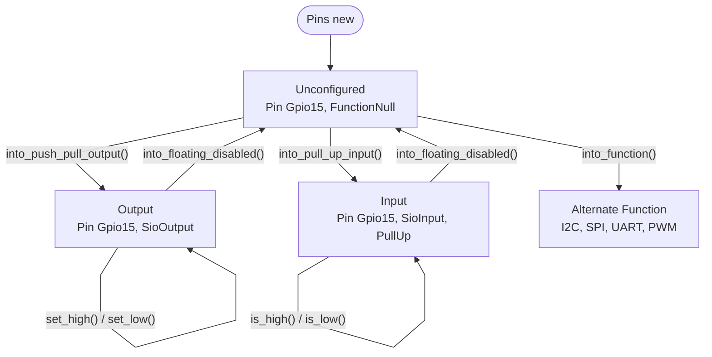

import TawkWidget from '../../../../components/TawkWidget.astro';
import UniversalContentContributors from '../../../../components/UniversalContentContributors.astro';
import InArticleAd from '../../../../components/InArticleAd.astro';
import Copyright from '../../../../components/Copyright.astro';
import BionicText from '../../../../components/BionicText.astro';
import TailwindWrapper from '../../../../components/TailwindWrapper.jsx';
import { Tabs, TabItem } from '@astrojs/starlight/components';
import { Card, CardGrid, Badge, Steps, LinkButton, FileTree } from '@astrojs/starlight/components';

<UniversalContentContributors 
  contributors={frontmatter.contributors}
/>


import EmbeddedRustRp2040Comments from '../../../../components/embedded-rust-rp2040/EmbeddedRustRp2040Comments.astro';

In C, a GPIO pin is just a number. You pass it to `gpio_init()`, `gpio_set_dir()`, and `gpio_put()`, and the compiler has no idea whether the pin is configured, what direction it is set to, or whether another part of your code is also modifying it. Bugs from misconfigured pins, double initialization, and unsynchronized access to shared peripherals are common and hard to trace. Rust solves all of these at compile time through ownership, borrowing, and the typestate pattern. In this lesson, you will see exactly how these mechanisms work by building a debounced button that toggles an LED, with proper error handling and safe interrupt-shared state. #Rust #Ownership #EmbeddedSystems

## What We Are Building

<Card title="Button-Toggled LED with Software Debounce" icon="star">
A push button on GP14 toggles an external LED on GP15. Each press flips the LED state, with a 50 ms software debounce to ignore contact bounce. The program uses polling (not interrupts, which come in Lesson 3) and demonstrates ownership transfer, borrowing, Result-based error handling, and the typestate GPIO pattern. A second button on GP16 controls a second LED on GP17, demonstrating how to pass peripheral references between functions.
</Card>

**Project specifications:**

| Parameter | Value |
|-----------|-------|
| Board | Raspberry Pi Pico (RP2040) |
| Button 1 | GP14, active low with internal pull-up |
| LED 1 | GP15, push-pull output |
| Button 2 | GP16, active low with internal pull-up |
| LED 2 | GP17, push-pull output |
| Debounce time | 50 ms |
| Logging | defmt over RTT |

### Bill of Materials

| Component | Quantity | Notes |
|-----------|----------|-------|
| Raspberry Pi Pico | 1 | From Lesson 1 |
| Debug probe | 1 | From Lesson 1 |
| Push buttons | 2 | Tactile momentary switches |
| LEDs (any color) | 2 | 3mm or 5mm |
| 220 ohm resistors | 2 | Current limiting for LEDs |
| Breadboard + jumper wires | 1 set | From Lesson 1 |

### Wiring Table

| Pico Pin | Connection | Notes |
|----------|------------|-------|
| GP14 | Button 1 (one leg) | Other leg to GND; internal pull-up enabled |
| GP15 | LED 1 anode (long leg) | Through 220 ohm resistor to GND |
| GP16 | Button 2 (one leg) | Other leg to GND; internal pull-up enabled |
| GP17 | LED 2 anode (long leg) | Through 220 ohm resistor to GND |
| GND | Button GND, LED cathodes | Common ground |

## Ownership in Rust: The Hardware Connection

<InArticleAd />


Ownership is Rust's central concept. Every value has exactly one owner. When the owner goes out of scope, the value is dropped (cleaned up). When you assign a value to a new variable or pass it to a function, ownership moves (the original variable becomes unusable). This is not garbage collection; it is a compile-time analysis with zero runtime cost.

For embedded systems, ownership maps perfectly to hardware: a peripheral should have exactly one owner. If two parts of your code both "own" the UART, they might send data simultaneously and corrupt each other's output. If two functions both configure the same GPIO pin, one might overwrite the other's settings. In C, preventing this requires discipline and documentation. In Rust, the compiler enforces it.

### Move Semantics

```rust
let pins = rp_pico::Pins::new(
    pac.IO_BANK0,
    pac.PADS_BANK0,
    sio.gpio_bank0,
    &mut pac.RESETS,
);

// `pins.gpio15` is a pin in its unconfigured state
let led = pins.gpio15.into_push_pull_output();
// `pins.gpio15` is MOVED into `led` and no longer exists

// This would not compile:
// let another_led = pins.gpio15.into_push_pull_output();
//                   ^^^^^^^^^^^ value used after move
```

The `.into_push_pull_output()` method consumes `pins.gpio15` by taking ownership of it. The original `pins.gpio15` field is now empty. If you try to use it again, the compiler rejects the code with a "value used after move" error. In C, nothing prevents you from calling `gpio_init(15)` twice.

### Why This Matters for Hardware

Consider this C bug:

```c
// Module A: configures GP15 as a status LED output
gpio_init(15);
gpio_set_dir(15, GPIO_OUT);

// Module B (written by someone else): uses GP15 as a sensor input
gpio_init(15);  // silently reconfigures the pin!
gpio_set_dir(15, GPIO_IN);

// Module A tries to set the LED, but the pin is now an input
gpio_put(15, 1);  // does nothing, no error, no warning
```

In Rust, this is structurally impossible. Module A takes ownership of the pin. Module B cannot access it.

## Typestate GPIO

<InArticleAd />




The typestate pattern encodes the state of a resource in its type. The rp2040-hal uses this extensively for GPIO pins. A pin that has not been configured has a different type than a pin configured as an output, and both have different types from a pin configured as an input. The compiler uses these types to determine which operations are valid.

### Pin State Types

```rust
use rp2040_hal::gpio::{
    Pin, FunctionSio, PullDown, PullUp, PullNone,
    bank0::Gpio15,
};

// Unconfigured pin (after Pins::new())
// Type: Pin<Gpio15, FunctionNull, PullDown>

// Configured as push-pull output
let led = pins.gpio15.into_push_pull_output();
// Type: Pin<Gpio15, FunctionSio<SioOutput>, PullDown>

// Configured as input with pull-up
let button = pins.gpio14.into_pull_up_input();
// Type: Pin<Gpio14, FunctionSio<SioInput>, PullUp>
```

### What the Compiler Prevents

```rust
// Attempt 1: read from an output pin
let led = pins.gpio15.into_push_pull_output();
let state = led.is_high();  // COMPILE ERROR: is_high() not implemented
                              // for SioOutput pins

// Attempt 2: write to an input pin
let button = pins.gpio14.into_pull_up_input();
button.set_high();  // COMPILE ERROR: set_high() not implemented
                     // for SioInput pins

// Attempt 3: use a pin before configuring it
let raw_pin = pins.gpio15;  // still FunctionNull type
raw_pin.set_high();  // COMPILE ERROR: set_high() not defined
                      // for FunctionNull pins
```

Every one of these mistakes compiles and runs in C (usually doing nothing visible, or worse, doing something subtly wrong). In Rust, every one is caught before the code reaches the chip.

### Reconfiguring Pins

Sometimes you need to change a pin's configuration at runtime (for example, switching between input and output for a bidirectional bus). Rust handles this through type state transitions:

```rust
// Start as output
let mut led = pins.gpio15.into_push_pull_output();
led.set_high().unwrap();

// Reconfigure as input (consumes the output pin, returns an input pin)
let sensor = led.into_pull_up_input();
let value = sensor.is_high().unwrap();

// Reconfigure back to output
let mut led = sensor.into_push_pull_output();
led.set_low().unwrap();
```

Each transition consumes the old type and returns a new one. You cannot accidentally hold references to both the input and output versions of the same pin.

## Button Debouncing with Ownership

<InArticleAd />


Mechanical push buttons do not produce clean transitions. When you press a button, the contacts bounce several times over 1 to 20 ms, generating multiple rapid edges. Without debouncing, a single press might register as 5 or 10 presses. The debounce logic owns its state (last stable reading, timestamp of last change) and borrows the button pin to read it.

### Debouncer Struct

```rust
use embedded_hal::digital::InputPin;
use rp2040_hal::fugit::MicrosDurationU64;

/// Software debouncer that owns its internal state.
/// The button pin is borrowed (not owned) so the caller
/// retains ownership of the hardware.
pub struct Debouncer {
    last_raw: bool,
    stable: bool,
    last_change_us: u64,
    debounce_us: u64,
}

impl Debouncer {
    /// Create a new debouncer with the given debounce period.
    pub fn new(debounce_us: u64) -> Self {
        Debouncer {
            last_raw: false,
            stable: false,
            last_change_us: 0,
            debounce_us,
        }
    }

    /// Update the debouncer with the current pin state and timestamp.
    /// Returns true if a falling edge (button press) was detected.
    pub fn update<P: InputPin>(&mut self, pin: &mut P, now_us: u64) -> bool {
        // Read the current raw state (active low: pressed = low = false)
        let raw = pin.is_high().unwrap_or(true);

        if raw != self.last_raw {
            self.last_change_us = now_us;
            self.last_raw = raw;
        }

        let elapsed = now_us.wrapping_sub(self.last_change_us);
        if elapsed >= self.debounce_us && raw != self.stable {
            let old_stable = self.stable;
            self.stable = raw;
            // Return true on falling edge (button press with pull-up)
            return old_stable && !self.stable;
        }

        false
    }

    /// Get the current debounced state.
    pub fn is_pressed(&self) -> bool {
        !self.stable  // active low with pull-up
    }
}
```

Notice the ownership patterns:

- `Debouncer` **owns** its internal state (`last_raw`, `stable`, timestamps). Nobody else can modify these.
- The `update()` method **borrows** the pin (`&P`) rather than owning it. This means the caller keeps ownership of the pin and can use it elsewhere if needed.
- The generic `P: InputPin` means this debouncer works with any pin type that implements `InputPin`, not just RP2040 pins.

## Error Handling: Result vs C Error Codes

<InArticleAd />


In C embedded code, error handling is inconsistent. Some functions return error codes, some set global error flags, some return sentinel values, and some simply ignore errors. The compiler does not enforce checking any of these.

```c
// C: errors are easily ignored
int status = i2c_read(I2C0, addr, buf, len);
// What if status < 0? Nothing forces you to check.

gpio_put(15, 1);  // What if pin 15 is not initialized? No indication.
```

In Rust, operations that can fail return `Result<T, E>`. You must handle the Result before you can access the value inside. The compiler will warn (and can be configured to error) if you ignore a Result.

```rust
// Rust: the compiler tracks error handling
match led.set_high() {
    Ok(()) => defmt::info!("LED on"),
    Err(e) => defmt::error!("Failed to set LED: {:?}", e),
}

// Or, for infallible operations where you know it cannot fail:
led.set_high().unwrap();  // panics if it somehow fails (documents your assumption)

// Or, to propagate errors up:
fn toggle_led(led: &mut impl OutputPin) -> Result<(), impl core::fmt::Debug> {
    led.set_high()?;  // the ? operator returns early on error
    Ok(())
}
```

### The `?` Operator

The `?` operator is Rust's way of propagating errors. If the expression before `?` is `Err(e)`, the function returns early with that error. If it is `Ok(v)`, the value `v` is extracted. This replaces the C pattern of checking every return value:

```c
// C: tedious error checking
int status;
status = spi_init();
if (status != 0) return status;
status = spi_write(data, len);
if (status != 0) return status;
status = spi_read(buf, len);
if (status != 0) return status;
```

```rust
// Rust: clean error propagation
fn spi_transfer(spi: &mut impl SpiDevice, data: &[u8], buf: &mut [u8])
    -> Result<(), SpiError>
{
    spi.write(data)?;
    spi.read(buf)?;
    Ok(())
}
```

## Shared Resources: Borrowing and References

<InArticleAd />


Functions often need access to peripherals they do not own. Rust handles this through references (borrowing). You can lend a peripheral to a function without giving up ownership.

### Immutable References (`&T`)

Multiple parts of the code can read a peripheral simultaneously through immutable references:

```rust
fn print_button_state(button: &impl InputPin) {
    if button.is_high().unwrap() {
        defmt::info!("Button released");
    } else {
        defmt::info!("Button pressed");
    }
}

// Multiple reads are fine
let button = pins.gpio14.into_pull_up_input();
print_button_state(&button);  // borrows button
print_button_state(&button);  // borrows again, no problem
// button is still owned here
```

### Mutable References (`&mut T`)

Only one mutable reference can exist at a time. This prevents data races at compile time:

```rust
fn toggle_led(led: &mut impl OutputPin, on: bool) {
    if on {
        led.set_high().unwrap();
    } else {
        led.set_low().unwrap();
    }
}

let mut led = pins.gpio15.into_push_pull_output();
toggle_led(&mut led, true);   // exclusive mutable borrow
toggle_led(&mut led, false);  // exclusive mutable borrow (previous one ended)
```

The compiler guarantees that while `toggle_led` has a `&mut` reference to the LED, no other code can access it. This eliminates an entire class of concurrency bugs.

## Static Variables and the Mutex Pattern

<InArticleAd />


In C, sharing data between the main loop and an interrupt handler is simple (and dangerous):

```c
// C: global mutable state (common source of bugs)
volatile int counter = 0;
volatile bool flag = false;

void TIM2_IRQHandler(void) {
    counter++;
    flag = true;
}

int main(void) {
    while (1) {
        if (flag) {
            flag = false;
            printf("Counter: %d\n", counter);
            // BUG: counter might change between the flag check and printf
        }
    }
}
```

This has a data race: the interrupt can fire between checking `flag` and reading `counter`, giving an inconsistent view. The `volatile` keyword only prevents the compiler from optimizing away the read; it does not prevent torn reads or inconsistent state.

Rust makes global mutable state intentionally difficult. You cannot have a `static mut` variable without `unsafe`, and the compiler is right to warn you: mutable statics are inherently unsafe because any code can access them without synchronization.

### The Safe Pattern: Mutex with Critical Section

```rust
use core::cell::RefCell;
use critical_section::Mutex;

// Shared state protected by a Mutex
// The Mutex ensures access only happens inside a critical section
// RefCell provides interior mutability (runtime borrow checking)
static SHARED_COUNTER: Mutex<RefCell<u32>> = Mutex::new(RefCell::new(0));
static SHARED_FLAG: Mutex<RefCell<bool>> = Mutex::new(RefCell::new(false));

// In an interrupt handler:
fn timer_interrupt() {
    critical_section::with(|cs| {
        let mut counter = SHARED_COUNTER.borrow_ref_mut(cs);
        *counter += 1;
        let mut flag = SHARED_FLAG.borrow_ref_mut(cs);
        *flag = true;
    });
}

// In the main loop:
fn check_counter() {
    critical_section::with(|cs| {
        let flag = SHARED_FLAG.borrow_ref(cs);
        if *flag {
            drop(flag);  // release the immutable borrow before mutating
            let counter = SHARED_COUNTER.borrow_ref(cs);
            defmt::info!("Counter: {}", *counter);
            let mut flag = SHARED_FLAG.borrow_ref_mut(cs);
            *flag = false;
        }
    });
}
```

The `critical_section::with()` function disables interrupts, executes the closure, and re-enables interrupts. The `CriticalSection` token (`cs`) passed to the closure is proof that interrupts are disabled, and the `Mutex` requires this token to grant access. This means you cannot access the shared data without first disabling interrupts, which eliminates the data race by construction.

<Tabs>
<TabItem label="C: volatile global">
```c
volatile uint32_t counter = 0;

void ISR(void) {
    counter++;  // no synchronization
}

int main(void) {
    // might read a torn value on 8-bit MCUs
    // might read between ISR updates on 32-bit MCUs
    printf("%d\n", counter);
}
```
</TabItem>
<TabItem label="Rust: Mutex + critical section">
```rust
static COUNTER: Mutex<RefCell<u32>> =
    Mutex::new(RefCell::new(0));

// In ISR:
critical_section::with(|cs| {
    let mut c = COUNTER.borrow_ref_mut(cs);
    *c += 1;
});

// In main:
critical_section::with(|cs| {
    let c = COUNTER.borrow_ref(cs);
    defmt::info!("{}", *c);
});
```
</TabItem>
</Tabs>

## Complete Project: Button-Toggled LED

<InArticleAd />


### Project Structure

<FileTree>
- rp2040-button-led/
  - .cargo/
    - config.toml
  - src/
    - main.rs
  - Cargo.toml
  - memory.x
  - build.rs
  - Embed.toml
</FileTree>

### Cargo.toml

```toml
[package]
name = "rp2040-button-led"
version = "0.1.0"
edition = "2021"

[dependencies]
rp2040-hal = { version = "0.10", features = ["rt", "critical-section-impl"] }
rp-pico = "0.9"
cortex-m = "0.7"
cortex-m-rt = "0.7"
panic-halt = "1.0"
defmt = "0.3"
defmt-rtt = "0.4"
embedded-hal = "1.0"

[profile.release]
codegen-units = 1
debug = 2
debug-assertions = false
incremental = false
lto = "fat"
opt-level = "s"
overflow-checks = false
```

Use the same `memory.x`, `build.rs`, `.cargo/config.toml`, and `Embed.toml` from Lesson 1.

### src/main.rs

```rust
//! Button-toggled LED with software debounce on the Raspberry Pi Pico.
//!
//! GP14: Button 1 (active low, internal pull-up)
//! GP15: LED 1 (push-pull output)
//! GP16: Button 2 (active low, internal pull-up)
//! GP17: LED 2 (push-pull output)
//!
//! Each button press toggles the corresponding LED.
//! Demonstrates ownership, borrowing, typestate GPIO, and Result handling.

#![no_std]
#![no_main]

use panic_halt as _;
use defmt_rtt as _;

use rp_pico::entry;
use rp_pico::hal;
use rp_pico::hal::pac;
use rp_pico::hal::Clock;

use embedded_hal::digital::{InputPin, OutputPin};

// ---- Debouncer (ownership pattern) ----

/// Software debouncer. Owns its internal timing state.
/// Borrows the pin to read it (does not take ownership).
struct Debouncer {
    last_raw: bool,
    stable: bool,
    last_change_us: u64,
    debounce_us: u64,
}

impl Debouncer {
    fn new(debounce_us: u64) -> Self {
        Debouncer {
            last_raw: true,    // pull-up: released = high = true
            stable: true,
            last_change_us: 0,
            debounce_us,
        }
    }

    /// Update with current pin state and timestamp.
    /// Returns true on a debounced falling edge (button press).
    fn update<P: InputPin>(&mut self, pin: &mut P, now_us: u64) -> bool {
        let raw = pin.is_high().unwrap_or(true);

        if raw != self.last_raw {
            self.last_change_us = now_us;
            self.last_raw = raw;
        }

        let elapsed = now_us.wrapping_sub(self.last_change_us);
        if elapsed >= self.debounce_us && raw != self.stable {
            let old_stable = self.stable;
            self.stable = raw;
            // Falling edge: was high (released), now low (pressed)
            return old_stable && !self.stable;
        }

        false
    }
}

// ---- LED controller (borrowing pattern) ----

/// Toggle an LED. Takes a mutable reference (borrow), not ownership.
/// The caller retains ownership of the pin.
fn toggle_led<P: OutputPin>(led: &mut P, state: &mut bool) {
    *state = !*state;
    if *state {
        led.set_high().unwrap();
    } else {
        led.set_low().unwrap();
    }
}

/// Report LED state. Takes an immutable reference to the state.
fn report_state(name: &str, state: &bool) {
    if *state {
        defmt::info!("{}: ON", name);
    } else {
        defmt::info!("{}: OFF", name);
    }
}

// ---- Entry point ----

#[entry]
fn main() -> ! {
    defmt::info!("Booting rp2040-button-led");

    // Peripheral access (singleton: can only be called once)
    let mut pac = pac::Peripherals::take().unwrap();
    let mut watchdog = hal::Watchdog::new(pac.WATCHDOG);

    let clocks = hal::clocks::init_clocks_and_plls(
        rp_pico::XOSC_CRYSTAL_FREQ,
        pac.XOSC,
        pac.CLOCKS,
        pac.PLL_SYS,
        pac.PLL_USB,
        &mut pac.RESETS,
        &mut watchdog,
    )
    .ok()
    .unwrap();

    // Timer for timestamps and delays
    let timer = hal::Timer::new(pac.TIMER, &mut pac.RESETS, &clocks);

    // GPIO setup (each pin is consumed by its configuration method)
    let sio = hal::Sio::new(pac.SIO);
    let pins = rp_pico::Pins::new(
        pac.IO_BANK0,
        pac.PADS_BANK0,
        sio.gpio_bank0,
        &mut pac.RESETS,
    );

    // Configure pins using the typestate pattern.
    // Each .into_*() call CONSUMES the pin and returns a new typed pin.
    let mut button1 = pins.gpio14.into_pull_up_input();    // GP14: Button 1
    let mut led1 = pins.gpio15.into_push_pull_output(); // GP15: LED 1
    let mut button2 = pins.gpio16.into_pull_up_input();    // GP16: Button 2
    let mut led2 = pins.gpio17.into_push_pull_output(); // GP17: LED 2

    // Start with LEDs off
    led1.set_low().unwrap();
    led2.set_low().unwrap();

    // Debouncers own their state, borrow the buttons
    let mut debounce1 = Debouncer::new(50_000); // 50 ms in microseconds
    let mut debounce2 = Debouncer::new(50_000);

    // LED states (owned by main, borrowed by toggle_led)
    let mut led1_on = false;
    let mut led2_on = false;

    let mut press_count: u32 = 0;

    defmt::info!("Ready. Press buttons to toggle LEDs.");

    loop {
        let now = timer.get_counter().ticks();

        // Check button 1 (borrows button1 immutably, debounce1 mutably)
        if debounce1.update(&mut button1, now) {
            // Toggle LED 1 (borrows led1 mutably)
            toggle_led(&mut led1, &mut led1_on);
            press_count += 1;
            defmt::info!(
                "Button 1 pressed (total: {})",
                press_count
            );
            report_state("LED 1", &led1_on);
        }

        // Check button 2 (borrows button2 immutably, debounce2 mutably)
        if debounce2.update(&mut button2, now) {
            // Toggle LED 2 (borrows led2 mutably)
            toggle_led(&mut led2, &mut led2_on);
            press_count += 1;
            defmt::info!(
                "Button 2 pressed (total: {})",
                press_count
            );
            report_state("LED 2", &led2_on);
        }
    }
}
```

### Build and Flash

```bash
cargo run --release
```

Expected RTT output:

```
INFO  Booting rp2040-button-led
INFO  Ready. Press buttons to toggle LEDs.
INFO  Button 1 pressed (total: 1)
INFO  LED 1: ON
INFO  Button 1 pressed (total: 2)
INFO  LED 1: OFF
INFO  Button 2 pressed (total: 3)
INFO  LED 2: ON
```

### Testing Checklist

<Steps>
1. Press Button 1 once. LED 1 should turn on. Press again. LED 1 should turn off.

2. Press Button 2 once. LED 2 should turn on independently of LED 1.

3. Press both buttons rapidly. Each LED should toggle independently. The debounce should prevent double-counting.

4. Hold a button down. Only one toggle should register (on the initial press, not while held).

5. Check the RTT output. Each press should show exactly one "Button N pressed" message with an incrementing total count.
</Steps>

## Ownership Patterns Summary

<InArticleAd />


| Pattern | When to Use | Example in This Lesson |
|---------|-------------|----------------------|
| **Move (ownership transfer)** | When a function needs permanent control of a resource | `pins.gpio15.into_push_pull_output()` consumes the pin |
| **Immutable borrow (`&T`)** | When a function needs to read but not modify | `debounce.update(&button, now)` reads the button |
| **Mutable borrow (`&mut T`)** | When a function needs to modify | `toggle_led(&mut led, &mut state)` sets the LED |
| **Owned state in struct** | When state must be encapsulated | `Debouncer` owns its timing variables |
| **Generics with traits** | When code should work with any compatible type | `fn toggle_led<P: OutputPin>(led: &mut P, ...)` |

### Rules the Compiler Enforces

1. **One owner at a time.** A value can have exactly one owner. Moving transfers ownership.
2. **Many immutable borrows OR one mutable borrow.** Never both simultaneously.
3. **Borrows must not outlive the owner.** The compiler tracks lifetimes.
4. **No use after move.** Once a value is moved, the old name is invalid.

These rules, applied to hardware peripherals, eliminate:
- Double initialization of the same peripheral
- Reading a pin configured as output (or writing to an input)
- Using an unconfigured peripheral
- Two modules modifying the same peripheral without synchronization
- Use-after-free of DMA buffers (covered in Lesson 5)

## Production Notes

<InArticleAd />


<Card title="Production Considerations" icon="setting">

**Typestate overhead:** The typestate pattern is entirely a compile-time construct. At runtime, `pin.into_push_pull_output()` generates the same register writes as the C equivalent. There is no extra RAM, flash, or CPU overhead. The safety is free.

**Debounce timing:** The 50 ms debounce period works well for most tactile switches. For capacitive touch buttons or reed switches, you may need different values. The debouncer struct makes this easy to tune per-button.

**Pulling pins low vs high:** The RP2040 has configurable internal pull-ups and pull-downs. Using `into_pull_up_input()` and wiring buttons to GND is the most common pattern because it reduces external components. Make sure your buttons connect between the pin and GND, not between the pin and 3.3V.

**Critical section cost:** On the single-core RP2040, `critical_section::with()` disables interrupts globally. The critical section should be as short as possible to minimize interrupt latency. Copy data out of the Mutex inside the closure, then process it outside. On the dual-core RP2040, the critical section uses spinlocks, which are more expensive.

**RefCell panics:** `RefCell` performs runtime borrow checking. If you borrow mutably while an immutable borrow is still active, it panics. In `no_std`, this triggers the panic handler. During development, use `panic-probe` to see the panic location over defmt.
</Card>

## What You Have Learned

<InArticleAd />


<Card title="Lesson 2 Complete" icon="approve-check">

**Ownership concepts:**
- Move semantics: `.into_*()` methods consume the original value
- Peripheral singletons prevent double initialization
- One owner at a time, enforced at compile time

**Borrowing:**
- Immutable references (`&T`) for reading peripherals
- Mutable references (`&mut T`) for modifying peripherals
- Generic functions with trait bounds for reusable code

**Typestate GPIO:**
- Pin types encode configuration state (input, output, pull-up, pull-down)
- Invalid operations (write to input, read from output) are compile errors
- Type transitions with `.into_*()` methods

**Error handling:**
- `Result<T, E>` for fallible operations
- `unwrap()`, pattern matching, and the `?` operator
- Compiler enforcement of error checking

**Shared state:**
- `Mutex<RefCell<T>>` for interrupt-safe global state
- `critical_section::with()` for atomic access
- Why `static mut` is unsafe and what to use instead
</Card>

:::tip[Next Lesson]
In [Lesson 3: Timers, PWM, and Interrupts](/education/embedded-rust-rp2040/timers-pwm-interrupts), you will configure RP2040 timers, generate servo-grade PWM, handle interrupts with the critical-section crate, and read analog inputs. You will build a potentiometer-controlled servo with buzzer feedback, combining timers, PWM, ADC, and interrupts in one project.
:::

<EmbeddedRustRp2040Comments />


<InArticleAd />
<TawkWidget />
<Copyright />